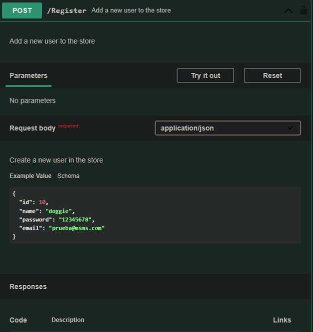

# DOCUMENTO DE DISEÑO TECNICO
Cliente FOOBREX LOGISTICS 

# TABLA DE CONTENIDO

- Diagrama de Componentes
- Diagrama de Clases
- Diagrama Casos de Uso
- Diagrama Entidad Relacion
- Listado Inferfaces
- Diseño de Interfaces

# Diagrama de Componentes
Los diagramas de componentes UML representan las relaciones entre los componentes individuales del sistema mediante una vista de diseño estática. Pueden ilustrar aspectos de modelado lógico y físico.

# Diagrama de Clases

Diagrama de clases
El diagrama de clases es uno de los diagramas incluidos en UML 2.5 clasificado dentro de los diagramas de estructura y, como tal, se utiliza para representar los elementos que componen un sistema de información desde un punto de vista estático.

# Diagrama Casos de Uso
El diagrama de casos de uso es una forma de diagrama de comportamiento en lenguaje de modelado unificado (UML, del inglés Unified Modelling Language), con la que se representan procesos empresariales, así como sistemas y procesos de programación orientada a objetos.

# Diagrama Entidad Relacion

Un diagrama entidad-relación, también conocido como modelo entidad relación o ERD, es un tipo de diagrama de flujo que ilustra cómo las "entidades", como personas, objetos o conceptos, se relacionan entre sí dentro de un sistema

# Listado Inferfaces

* Spring Boot 2.3.5 / Apache Maven 3.6.3.
* Spring Boot Starter Actuator.
* Spring Cloud Stream.
* Spring Cloud Gateway.
* Spring Cloud Starter Consul Discovery.
* Spring Cloud Starter OpenFeign.
* Springdoc OpenApi.
* Spring Boot Starter Security.
* Spring Security OAuth2.
* ElasticSearch - Logstash - Kibana (ELK Stack).
* MongoDB.
* Mongo DB Express (Web-based MongoDB admin interface, written with Node.js and express).
* Consul Server.
* SSO Keycloak Server.
* Hadoop HDFS.
* Apache Nifi.
* Apache Tika Server.
* Rabbit MQ / STOMP protocol.
* Apache Kafka.
* Kafka Rest Proxy

# Diseño de Interfaces

| Task | Description |
| ------ | ------ |
| check_deployment_file_task | Check Deployment File |
| check_docker_task | Check Docker and Docker Compose Task |
| cleaning_environment_task | Cleaning Evironment Task |
| deploy | Deploys the Document Search Engine architecture and laun... |
| login | Authenticating with existing credentials |
| start | Start Containers |
| status | Status Containers |
| stop | Stop Containers |
| undeploy | UnDeploy Document Search Engine architecture |

### Containers Ports

In this table you can view the ports assigned to each service to access to the Web tools or something else you can use to monitoring the flow.

| Container | Port |
| ------ | ------ |
| Apache Nifi Dashboard UI | localhost:8080 |
| Hadoop Resource Manager | localhost:8081 |
| Kafka Topics UI | localhost:8082 |
| MongoDB Express | localhost:8083 |
| Kibana | localhost:8084 |
| Keycloak PGAdmin | localhost:8085 |
| Keycloak Admin UI | localhost:8086 |
| Consul Dashboard | localhost:8087 |
| Rabbit MQ - Stomp Dashboard | localhost:8088 |
| Hadoop NameNode Dashboard | localhost:8089 |
| API Gateway SSH  | localhost:2223 |
| SFTP Server | localhost:2222 |

